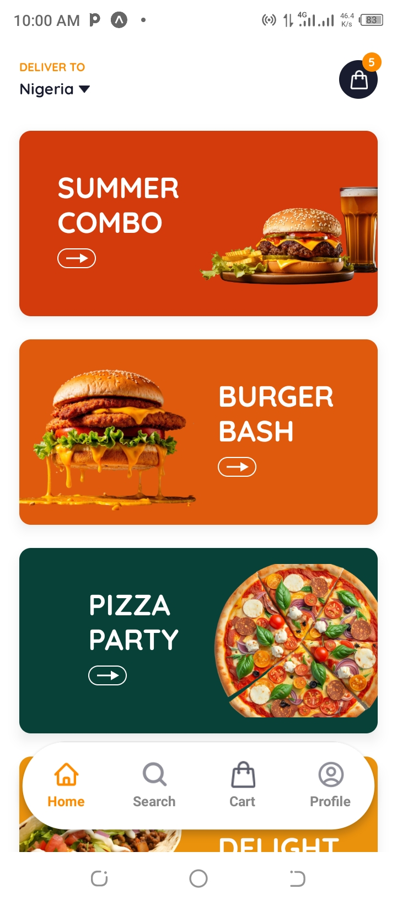
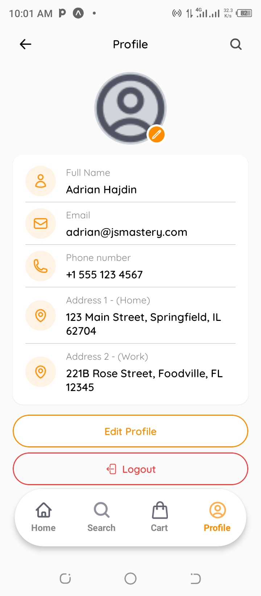

# 🍕 ChopChop - Food Delivery App

<div align="center">

**Modern Food Delivery Mobile Application**

A production-ready React Native food delivery app built with Expo, TypeScript, and Appwrite backend.

[](https://expo.dev/)
[](https://reactnative.dev/)
[](https://www.typescriptlang.org/)
[](https://appwrite.io/)

</div>

---

## 📱 About

ChopChop is a modern, feature-rich food delivery mobile application designed to connect users with their favorite restaurants. Built with cutting-edge technologies including React Native, Expo, TypeScript, and Appwrite for a seamless, secure, and scalable experience.

---
## 📱 Screenshots

<div align="center">

### Authentication Screens
  

### Main App Screens
   


</div>
---

## ✨ Features

### 🔐 Authentication & Profile
- Secure user authentication with Appwrite
- User profile management
- Avatar upload (camera & gallery integration)
- Multiple delivery addresses support

### 🍽️ Core Features
- Browse restaurants and menus
- Search functionality
- Shopping cart management
- Order history
- Real-time updates

### 🎨 UI/UX
- Modern, clean interface
- Smooth animations
- Pull-to-refresh
- Loading states
- Error handling
- Cross-platform (iOS & Android)

---

## 🛠️ Tech Stack

| Category | Technology |
|----------|-----------|
| **Framework** | React Native with Expo |
| **Language** | TypeScript |
| **Routing** | Expo Router (file-based) |
| **Styling** | NativeWind (Tailwind CSS) |
| **Backend** | Appwrite (BaaS) |
| **State Management** | Zustand |
| **Authentication** | Appwrite Auth |
| **Database** | Appwrite Database |
| **Storage** | Appwrite Storage |

---

## 📋 Prerequisites

Before you begin, ensure you have:

- **Node.js** (v18 or higher) - [Download](https://nodejs.org/)
- **npm** or **yarn** package manager
- **Expo CLI** - Install with: `npm install -g expo-cli`
- **Expo Go** app on your phone ([iOS](https://apps.apple.com/app/expo-go/id982107779) | [Android](https://play.google.com/store/apps/details?id=host.exp.exponent))
- **Appwrite account** - Free at [cloud.appwrite.io](https://cloud.appwrite.io)

---

## 🚀 Quick Start

### 1️⃣ Clone the Repository

```bash
git clone https://github.com/YOUR_USERNAME/ChopChop.git
cd ChopChop
```

### 2️⃣ Install Dependencies

```bash
npm install
```

### 3️⃣ Set Up Environment Variables

Create a `.env` file in the project root:

```bash
cp .env.example .env
```

Update with your Appwrite credentials:

```env
EXPO_PUBLIC_APPWRITE_ENDPOINT=https://cloud.appwrite.io/v1
EXPO_PUBLIC_APPWRITE_PROJECT_ID=your_project_id_here
EXPO_PUBLIC_APPWRITE_DATABASE_ID=your_database_id_here
EXPO_PUBLIC_APPWRITE_USERS_COLLECTION_ID=your_collection_id_here
EXPO_PUBLIC_APPWRITE_AVATARS_BUCKET_ID=your_bucket_id_here
```

### 4️⃣ Configure Appwrite

#### Create Appwrite Project
1. Go to [Appwrite Console](https://cloud.appwrite.io)
2. Create a new project
3. Copy your **Project ID**

#### Create Database & Collection
1. **Create Database:**
   - Navigate to **Databases** → **Create Database**
   - Name: `chopchop`
   - Copy **Database ID**

2. **Create Users Collection:**
   - **Create Collection** → Name: `users`
   - Copy **Collection ID**
   
3. **Add Attributes:**

| Attribute | Type | Size | Required |
|-----------|------|------|----------|
| userId | String | 255 | Yes |
| name | String | 255 | Yes |
| email | String | 255 | Yes |
| phone | String | 50 | No |
| address1 | String | 500 | No |
| address2 | String | 500 | No |
| avatar | String | 500 | No |
| avatarFileId | String | 255 | No |

4. **Set Permissions:**
   - Settings → Permissions → Enable **Document Security**
   - **Create:** `Any`
   - **Read, Update, Delete:** `Users`

#### Create Storage Bucket
1. **Create Bucket:**
   - Navigate to **Storage** → **Create Bucket**
   - Name: `avatars`
   - Copy **Bucket ID**

2. **Configure Bucket:**
   - **Max File Size:** `5242880` (5MB)
   - **Allowed Extensions:** `jpg, jpeg, png, webp`
   - **Enable Compression**

3. **Set Permissions:**
   - Enable **File Security**
   - **Create:** `Any`
   - **Read:** `Any`
   - **Update, Delete:** `Users`

### 5️⃣ Start the App

```bash
# Start development server
npm start

# Or clear cache
npm start --clear
```

**Scan the QR code with:**
- **iOS:** Camera app
- **Android:** Expo Go app

---

## 📁 Project Structure

```
ChopChop/
├── app/                          # Expo Router pages
│   ├── (auth)/                   # Authentication screens
│   │   ├── sign-in.tsx
│   │   └── sign-up.tsx
│   ├── (tabs)/                   # Tab navigation
│   │   ├── _layout.tsx
│   │   ├── index.tsx            # Home
│   │   ├── search.tsx
│   │   ├── cart.tsx
│   │   ├── profile.tsx
│   │   └── edit-profile.tsx
│   └── _layout.tsx
│
├── components/                   # Reusable components
│   ├── profile/
│   │   ├── ProfileHeader.tsx
│   │   ├── ProfileAvatar.tsx
│   │   ├── ProfileInfoCard.tsx
│   │   ├── InfoRow.tsx
│   │   └── ActionButtons.tsx
│   └── ui/
│
├── lib/                          # Utilities
│   ├── appwrite/
│   │   ├── config.ts
│   │   └── profile.service.ts
│   └── utils/
│
├── store/                        # State management
│   └── auth.store.ts
│
├── constants/                    # Constants
│   ├── colors.ts
│   ├── routes.ts
│   └── messages.ts
│
├── assets/                       # Static assets
│   ├── icons/
│   ├── images/
│   └── fonts/
│
├── .env                          # Environment variables (create this)
├── .env.example                  # Environment template
├── app.json                      # Expo configuration
├── package.json
├── tsconfig.json
└── tailwind.config.js
```

---

## 🎨 Color Palette

```typescript
{
  primary: '#FE8C00',      // Brand Orange
  error: '#F14141',        // Error Red
  success: '#2F9B65',      // Success Green
  white: '#FFFFFF',
  white100: '#FAFAFA',     // Light Background
  gray100: '#878787',      // Gray Text
  dark100: '#181C2E',      // Dark Text
}
```

---

## 🐛 Troubleshooting

### Common Issues

**❌ "Missing required parameter" error**
- ✅ Ensure all variables in `.env` are filled
- ✅ Restart server: `npm start --clear`

**❌ "Document not found" error**
- ✅ This is normal before signing up
- ✅ App shows mock data in development mode

**❌ Avatar upload fails**
- ✅ Check Appwrite bucket permissions (Read: `Any`)

**❌ TypeScript errors**
- ✅ Run `npm install`
- ✅ Restart TypeScript server in your IDE

**❌ Metro bundler issues**
- ✅ Clear cache: `npm start --clear`
- ✅ Delete `node_modules` and run `npm install`

---

## 📦 Building for Production

### Android
```bash
# Build APK
eas build --platform android --profile production

# Build for Play Store
eas build --platform android --profile production:aab
```

### iOS
```bash
# Build for App Store
eas build --platform ios --profile production
```

---

## 🤝 Contributing

Contributions are welcome! Please read [CONTRIBUTING.md](CONTRIBUTING.md) for details on our code of conduct and development process.

1. Fork the repository
2. Create your feature branch (`git checkout -b feature/AmazingFeature`)
3. Commit your changes (`git commit -m 'feat: add amazing feature'`)
4. Push to the branch (`git push origin feature/AmazingFeature`)
5. Open a Pull Request

---

## 📄 License

This project is licensed under the MIT License - see the [LICENSE](LICENSE) file for details.

---

## 🙏 Acknowledgments

- [Expo Team](https://expo.dev/) - Excellent development platform
- [Appwrite](https://appwrite.io/) - Powerful backend service
- [React Native Community](https://reactnative.dev/)
- [NativeWind](https://www.nativewind.dev/) - Tailwind for React Native

---

## 📞 Contact

**Project Link:** [https://github.com/Ushehu/ChopChop](https://github.com/Ushehu/ChopChop)

---

## 🗺️ Roadmap

- [ ] Restaurant listings
- [ ] Menu browsing
- [ ] Order placement
- [ ] Payment integration
- [ ] Real-time order tracking
- [ ] Push notifications
- [ ] Ratings & reviews
- [ ] Multi-language support

---

<div align="center">

**⭐ Star this repo if you find it helpful!**

Made with ❤️ and ☕

</div>
